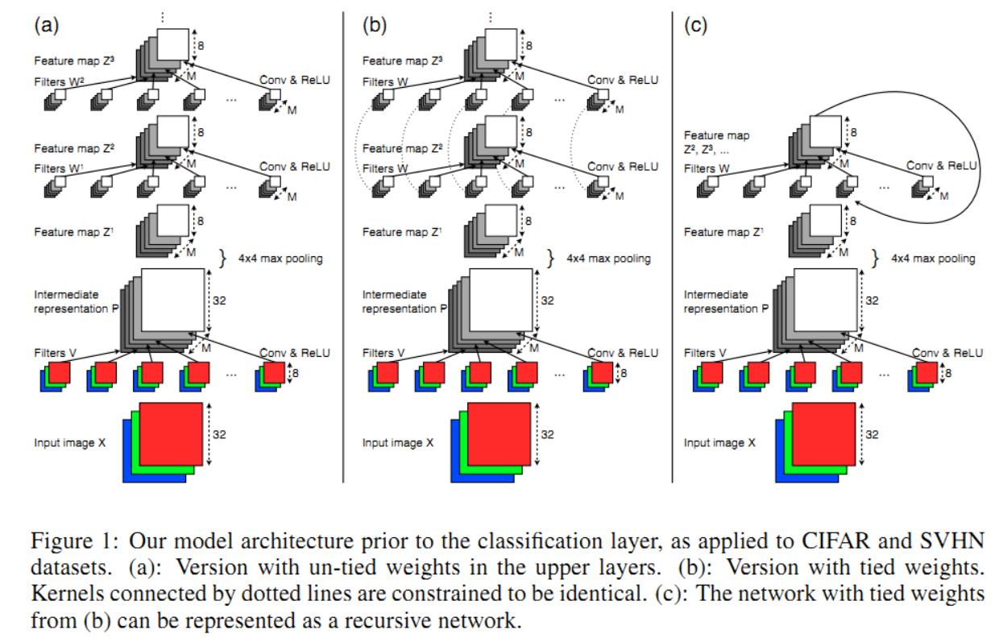

### Understanding Deep Architectures using a Recursive Convolutional Network

- 作者：David Eigen，Jason Rolfe，Rob Fergus，Yann LeCun。

  ------

- 这是14年的文章，提出**Recursive CNN** 结构，讨论网络层数、feature map数量和参数对识别效果的影响。

- Recursive CNN:

  - 简单概括：所有层（除了第一层）的feature map数相同，参数共享，层数可调。

  - 可以看成类似递归结构，故名Recursive CNN。

  - > The final hidden layer is subject to pixel-wise L2 normalization and passed into a logistic
    > classifier to produce a prediction Y.

  

- 实验：

  > 1. Control for M and P, vary L: Using the tied model (constant M and P), we evaluate
  >   performance for different numbers of layers L.
  > 2. Control for M and L, vary P: Compare pairs of tied and untied models with the same
  >   numbers of feature maps M and layers L. The number of parameters P increases when
  >   going from tied to untied model for each pair.
  > 3. Control for P and L, vary M: Compare pairs of untied and tied models with the same
  >   number of parameters P and layers L. The number of feature maps M increases when
  >   going from the untied to tied model for each pair.

  - 一定范围内，层数越多、参数越多，训练、泛化效果越好（符合常识）。

  - > We find that despite the different numbers of feature maps, the tied and untied models perform about the same in each case. Thus, performance is determined by the number of parameters.

- 作者建议：

  - > Allocating a fixed number of parameters across multiple layers tends to increase performance compared to putting them in few layers, even though this comes at the cost of decreasing the feature map dimension. 

------

